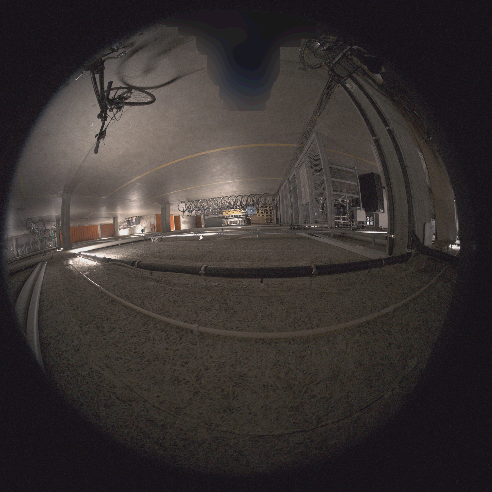
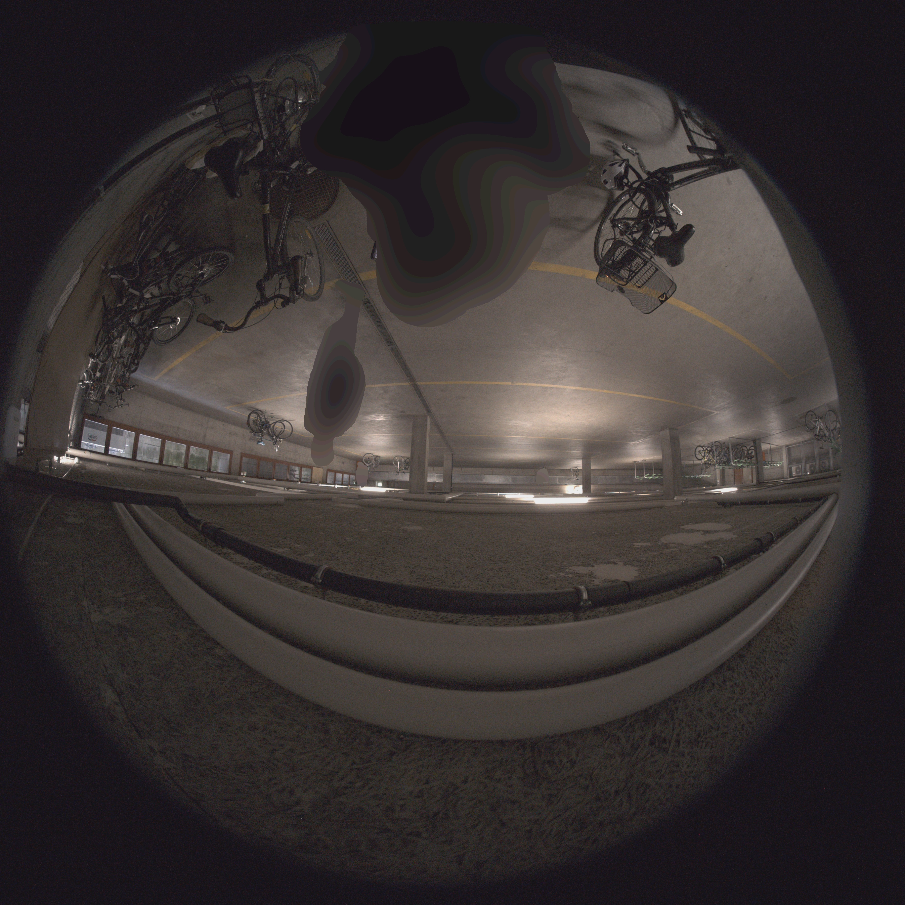

# Z+F FlexScanMask

**Anonymization tool for Z+F fisheye images (cam\_0 / cam\_1).**

Automatically detects and blurs persons and license plates using SAM3 (Segment Anything Model 3), and applies static hard masks to hide the scanner head. One-click setup, GPU-accelerated, with a simple GUI.

---

## Examples

**cam\_0** — scanner head (bottom) and persons blurred:



**cam\_1** — persons and license plates blurred:



---

## What it does

Each image is processed through this pipeline:

1. Rotate image 180° so persons appear upright for the AI model
2. SAM3 detects **persons** and **license plates** on the rotated image
3. SAM masks are rotated back to the original orientation
4. Camera-specific **hard mask** is loaded (`cam0_scanner_mask.png` or `cam1_scanner_mask.png`) to cover the scanner head
5. All masks are combined
6. Combined regions are blurred with multi-pass Gaussian blur + quantization
7. Output is saved to the output folder with the same filename

Vehicles other than license plates are not modified.

---

## Requirements

- Windows 10 / 11
- **Python 3.12**: https://www.python.org/downloads/
- **Git**: https://git-scm.com/downloads
- **HuggingFace account** with access to [facebook/sam3](https://huggingface.co/facebook/sam3)
- NVIDIA GPU with 8+ GB VRAM recommended (CPU fallback available, but slow)

---

## First-time setup

1. Double-click `start.bat`
2. It installs everything automatically:
   - Python virtual environment
   - PyTorch 2.10 with CUDA 12.8
   - All Python dependencies
   - SAM3 package from GitHub
   - SAM3 model checkpoint from HuggingFace (~7 GB)

During setup you will be asked for a **HuggingFace access token**:

1. Create a free account: https://huggingface.co
2. Request model access: https://huggingface.co/facebook/sam3 — click **"Agree and access repository"**
3. Create a token: https://huggingface.co/settings/tokens
   Under **"Repositories"** enable all 3 checkboxes:
   - [x] Read access to contents of all repos under your namespace
   - [x] View access requests for all gated repos under your namespace
   - [x] Read access to contents of all public gated repos you can access

   Click **"Create token"** and paste it into the prompt.

After the first setup, `start.bat` launches the app directly without reinstalling.

---

## Usage

1. Run `start.bat`
2. Click **Single image** or **Folder**
3. Select your input (one file or a folder of cam\_0 / cam\_1 images)
4. Optionally change the output folder (default: `FlexScanMask_Output/` next to input)
5. Click **Start**

Output files keep the original filename and are saved in the output folder.

---

## File structure

```
ZF-FlexScanMask/
├── flexscanmask.py          Main application
├── start.bat                One-click setup and launcher
├── requirements.txt         Python dependencies
├── cam0_scanner_mask.png    Hard mask for cam_0 scanner region
├── cam1_scanner_mask.png    Hard mask for cam_1 scanner region
├── checkpoints/
│   └── sam3/                SAM3 model files (downloaded on first run, ~7 GB)
└── README.md
```

---

## Routing logic

| Filename starts with | Hard mask applied        | SAM3 detects          |
|----------------------|--------------------------|-----------------------|
| `cam_0`              | `cam0_scanner_mask.png`  | person, license plate |
| `cam_1`              | `cam1_scanner_mask.png`  | person, license plate |
| anything else        | none                     | person, license plate |

---

## Hard masks (cam0 / cam1 scanner masks)

The hard masks define the static scanner region that is always blurred.

- **Black pixels** = blur this area
- **White pixels** = leave untouched
- Format: PNG, any resolution (auto-scaled to match the image)
- Filenames must be exactly `cam0_scanner_mask.png` and `cam1_scanner_mask.png` next to `flexscanmask.py`

Starter masks are included. To adjust them:

1. Open the mask in GIMP, Paint.NET, or Photoshop
2. Paint black over the scanner region
3. Save as PNG

The mask is applied in the original image orientation (after the SAM3 masks are rotated back).

---

## Performance

| Hardware          | Time per image  |
|-------------------|-----------------|
| RTX 4090          | ~5–15 seconds   |
| Other NVIDIA GPU  | ~15–60 seconds  |
| CPU only          | several minutes |

SAM3 uses CUDA automatically when a GPU is available.

---

## Troubleshooting

**`[ERROR] Import failed: No module named '...'`**
Run `start.bat` — it will install any missing packages automatically.

**HuggingFace login fails**
Make sure all 3 repository checkboxes are enabled when creating the token (see setup instructions above).

**SAM3 checkpoint missing**
Delete `.setup_complete` and run `start.bat` again. The checkpoint will be re-downloaded.

**Person not detected**
Lower `SAM3_CONFIDENCE` in `flexscanmask.py` (top of file, default `0.15` — try `0.10`).

**Output looks identical to input**
No regions were detected. Check the log panel in the app for details.

**Hard mask warning in log**
Place `cam0_scanner_mask.png` / `cam1_scanner_mask.png` next to `flexscanmask.py`.

---

## License

MIT License with Commons Clause — free for personal, academic, and non-commercial use.
Commercial use requires a separate written agreement. See [LICENSE](LICENSE) for full details.

Third-party components (SAM3, PyTorch, OpenCV, etc.) retain their own licenses.
