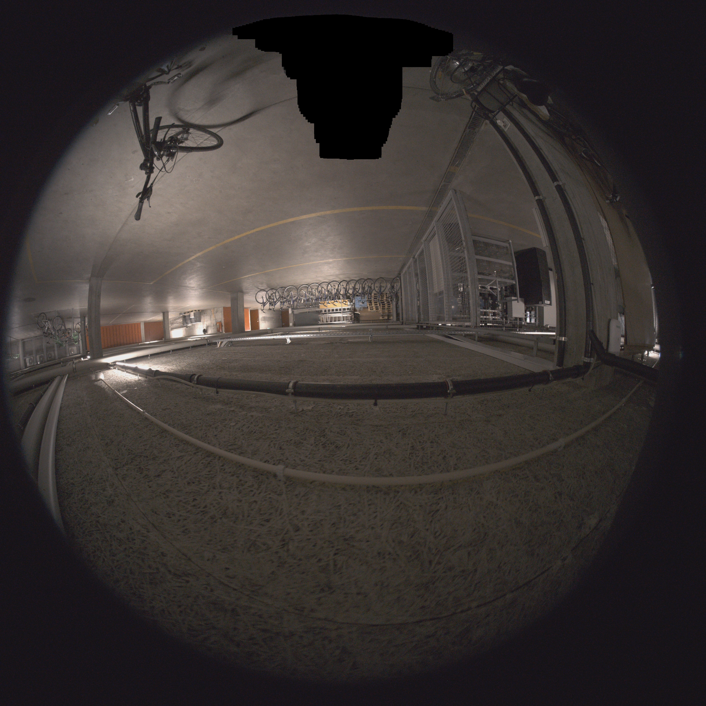
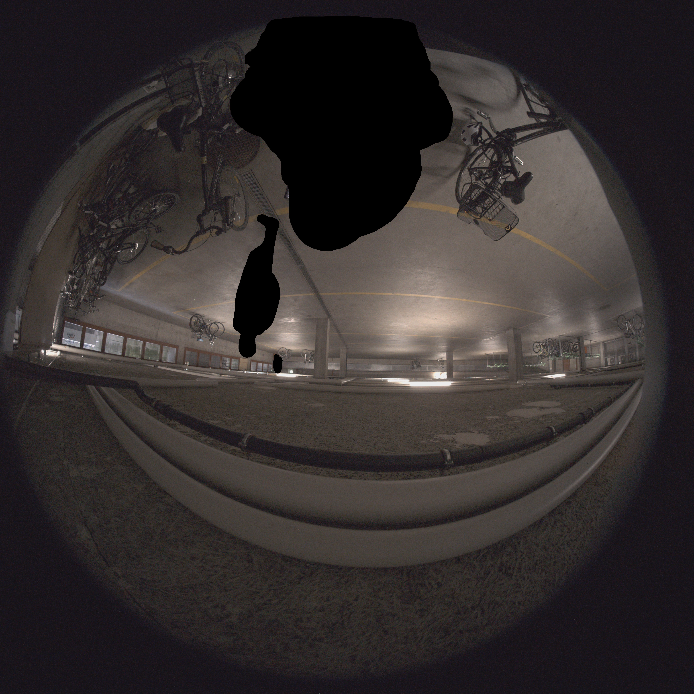

# Z+F FlexScanMask

**Anonymization tool for Z+F fisheye images (`cam_0` / `cam_1`).**

FlexScanMask detects and blurs persons and license plates using SAM3, and applies static hard masks to hide the scanner head. It includes a simple GUI, one-click setup, GPU acceleration, and camera-specific mask handling.

On a modern NVIDIA GPU, expect roughly **2-5 seconds per image** after the model has loaded. A sample processing log is included at `asset/Log.txt`.

---

## Examples

### cam_0 - scanner head + persons

| Blur | Black fill |
|------|------------|
|  |  |

### cam_1 - persons + license plates

| Blur | Black fill |
|------|------------|
|  |  |

---

## What It Does

Each image is processed through this pipeline:

1. Rotate image 180 degrees so persons appear upright for SAM3.
2. Detect persons and license plates on the rotated image.
3. Rotate SAM3 masks back to the original orientation.
4. For `cam_0`, optionally search the scanner area with the `blue device` prompt.
5. Load the camera-specific fallback mask from `mask/`.
6. Combine all masks.
7. Blur or black-fill the combined regions.
8. Save the output with the original filename.

Vehicles other than license plates are not modified.

---

## Requirements

- Windows 10 / 11
- Python 3.12: https://www.python.org/downloads/
- Git: https://git-scm.com/downloads
- HuggingFace account with access to `facebook/sam3`
- NVIDIA GPU with 8+ GB VRAM recommended

CPU fallback is available, but slow.

---

## First-Time Setup

1. Double-click `start.bat`.
2. The script creates a virtual environment and installs all dependencies.
3. It downloads the SAM3 checkpoint from HuggingFace on the first run.

During setup you will be asked for a HuggingFace access token:

1. Create a free account: https://huggingface.co
2. Request model access: https://huggingface.co/facebook/sam3
3. Create a token: https://huggingface.co/settings/tokens
4. Enable the repository read permissions requested by the setup script.
5. Paste the token into the prompt.

After the first setup, `start.bat` launches the app directly.

---

## Usage

1. Run `start.bat`.
2. Click **Single image** or **Folder**.
3. Select one file or a folder of `cam_0` / `cam_1` images.
4. Optionally change the output folder.
5. Click **Start**.

Output files keep the original filename and are saved in the selected output folder.

---

## File Structure

```text
ZF-FlexScanMask/
|-- flexscanmask.py             Main application
|-- start.bat                   One-click setup and launcher
|-- requirements.txt            Python dependencies
|-- mask/
|   |-- mask_cam_0.png          Search region for cam_0 scanner detection
|   |-- mask_cam_1.png          Search region for cam_1 scanner detection
|   |-- cam0_scanner_mask.png   Hard fallback mask for cam_0 scanner region
|   `-- cam1_scanner_mask.png   Hard fallback mask for cam_1 scanner region
|-- asset/
|   |-- Log.txt                 Example log from a full run
|   |-- cam_0_250003999_blur.jpg
|   |-- cam_0_250003999_black.jpg
|   |-- cam_1_250003999_blur.jpg
|   `-- cam_1_250003999_black.jpg
|-- checkpoints/
|   `-- sam3/                   SAM3 model files, downloaded on first run
`-- README.md
```

---

## Routing Logic

| Filename starts with | Hard mask applied            | SAM3 detects                       |
|----------------------|------------------------------|------------------------------------|
| `cam_0`              | `mask/cam0_scanner_mask.png` | person, license plate, blue device |
| `cam_1`              | `mask/cam1_scanner_mask.png` | person, license plate              |
| anything else        | none                         | person, license plate              |

---

## Masks

The fallback masks define the static scanner region that is always anonymized.

- Black pixels = anonymize this area
- White pixels = leave untouched
- Format: PNG, any resolution
- Fallback masks live in `mask/cam0_scanner_mask.png` and `mask/cam1_scanner_mask.png`
- Search region masks live in `mask/mask_cam_0.png` and `mask/mask_cam_1.png`

The masks are applied in the original image orientation.

---

## Performance

| Hardware          | Time per image  |
|-------------------|-----------------|
| Modern NVIDIA GPU | ~2-5 seconds    |
| Older NVIDIA GPU  | ~5-30 seconds   |
| CPU only          | several minutes |

SAM3 uses CUDA automatically when a GPU is available. The model load time is separate from the per-image time.

---

## Troubleshooting

**`[ERROR] Import failed: No module named '...'`**  
Run `start.bat`; it will install missing packages automatically.

**HuggingFace login fails**  
Check that the token has access to `facebook/sam3`.

**SAM3 checkpoint missing**  
Delete `.setup_complete` and run `start.bat` again.

**Person not detected**  
Lower the SAM confidence slider in the app.

**Output looks identical to input**  
No regions were detected. Check the log panel in the app.

**Hard mask warning in log**  
Place the missing mask file inside the `mask/` folder.

---

## License

MIT License with Commons Clause. Free for personal, academic, and non-commercial use.
Commercial use requires a separate written agreement. See [LICENSE](LICENSE) for full details.

Third-party components such as SAM3, PyTorch, and OpenCV retain their own licenses.
